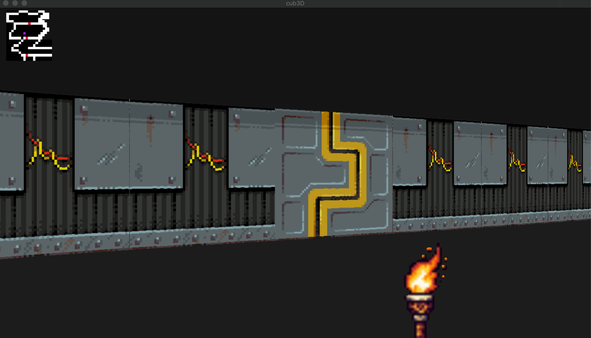

# Cub3D - raycasting game



This project is inspired by the world-famous Wolfenstein 3D game, which was the first FPS ever. It is a raycasting game, which means that it uses raycasting techniques to render a 3D environment in a 2D map.

The goal of this project is to create a dynamic view inside a maze, in which you can move around and interact with objects.

## How to play

### Installation
 
To install the game, you need to run the following commands:

Note: This project was developed on macOS, so it may not work on other operating systems, also it requires the `minilibx` library to run.

```bash
git clone https://github.com/bablilayoub/cub3D
cd cub3D
make all bonus clean
```

### Running the game

To run the game, you need to run the following command:

#### Without bonus
```bash
./cub3D maps/map.cub
```

#### With bonus
```bash
./cub3D_bonus maps/map_bonus.cub
```

### Controls

- `W` `A` `S` `D` to move around
- `←` `→` to rotate the camera
- `ESC` to exit the game
- `SPACE` to open/close the doors

## Map configuration

The map is configured in a `.cub` file, which is a text file that contains all the information needed to render the game.

Here is an example of a map configuration:

```map
NO ./textures/wall_n.xpm
SO ./textures/wall_s.xpm
WE ./textures/wall_w.xpm
EA ./textures/wall_e.xpm

F 220,100,0
C 0,100,220

1111111111111111111111111
1000000000110000000000001
101100000111000000W000001
1001000000000000000000001
1111111110110000011100001
1000000000110000011100001
1011100000000000000000001
1000100000110000000000001
1000100000110000000000001
1000111101111100000000001
1000000000000000000000001
1111111111111111111111111
```

- `NO`, `SO`, `WE`, `EA` are the paths to the textures of the walls
- `F` is the color of the floor
- `C` is the color of the ceiling
- The map is composed of numbers and letters:
  - `1` is a wall
  - `SPACE / TABS` are empty spaces
  - `0` is an empty space (floor)
  - `N`, `S`, `W`, `E` are the player's starting position and orientation
  - `D` is a door

## Bonus

- [x] Wall collisions
- [x] Sprite
- [x] Minimap
- [x] Doors
- [x] Mouse rotation
  
## Conclusion

This project was a great opportunity to learn more about raycasting techniques and game development. It was a challenging project, but it was also very rewarding to see the final result.

I hope you enjoy playing this game as much as I enjoyed creating it!
